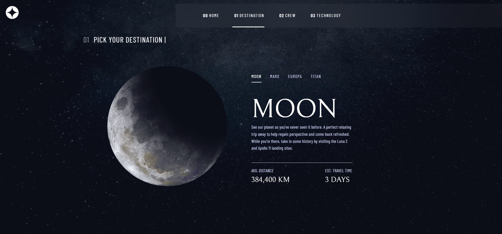
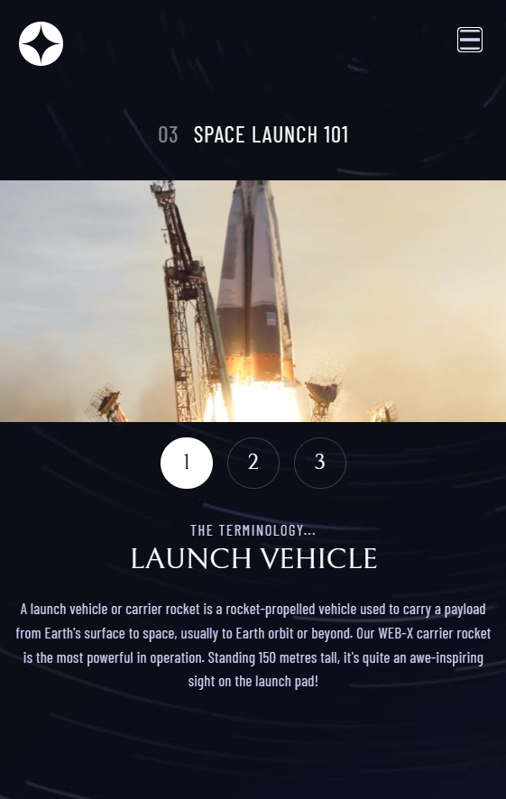

# Frontend Mentor - Space tourism website solution

Hi There! This is my solution to [Space tourism website challenge on Frontend Mentor](https://www.frontendmentor.io/challenges/space-tourism-multipage-website-gRWj1URZ3).

## Table of contents

- [Frontend Mentor - Space tourism website solution](#frontend-mentor---space-tourism-website-solution)
  - [Table of contents](#table-of-contents)
  - [Overview](#overview)
    - [The challenge](#the-challenge)
    - [Screenshots](#screenshots)
      - [📸 Desktop](#-desktop)
      - [📸 Mobile](#-mobile)
    - [Links](#links)
  - [My process](#my-process)
    - [Built with](#built-with)
    - [What I learned](#what-i-learned)
    - [Continued development](#continued-development)
  - [Author](#author)


## Overview

### The challenge

Users should be able to:

🟢 View the optimal layout for each of the website's pages depending on their device's screen size  
🟢 Observe hover states for all interactive elements on the page  
🟢 View the destiantion,crew and technology pages  
🟢 Toggle between the tabs to see new information  

### Screenshots

#### 📸 Desktop



#### 📸 Mobile 




### Links

🟢Solution URL: [https://github.com/quenyoni/space-tourism-fem](https://github.com/quenyoni/space-tourism-fem)  
🟢 Live Site URL: [https://space-tourism-fem-three.vercel.app](https://space-tourism-fem-three.vercel.app/)

## My process

### Built with

🟢 Semantic HTML5 markup  
🟢 CSS custom properties  
🟢 Flexbox  
🟢 CSS Grid  
🟢 Mobile-first workflow  
🟢 [React](https://react.dev/) - JS library  
🟢 [React Router](https://reactrouter.com/) - React framework  
🟢 [TailwindCSS](https://tailwindcss.com) - For Styling Components  


### What I learned


I have used earlier versions of React Router . Version 7 has multiple features that are new to me.
These features include:
➕ A newer simpler Router with layouts  
➕ Hydration Fallback  
➕ Page pre-rendering  


To see how you can add code snippets, see below:

```js 
export function HydrateFallback() {
  return (
    <div className="hydration__loader " >
      <div className="page__loader" />
      <p>Loading, please wait...</p>
    </div>
  );
}
```

This code snippet enables the page to display a spinner wile the React SPA hydrates in the background. 


```js
export default [
    layout('./layouts/wrapperLayout.tsx',
        [index('routes/index.tsx'),
            route('/home', "routes/home/home.tsx"), 
            route('/destination', "routes/destination/destination.tsx"),
          
             route('/destination/:destinationId', "routes/destination/destinationId.tsx"),
            route('/crew', "routes/crew/crew.tsx"),
            route('/crew/:crewId', "routes/crew/crewId.tsx"),
            route('/technology','routes/tech/technology.tsx'),
            route('/technology/:techId','routes/tech/technologyId.tsx'),
        
        ]
        
    )
   
  
  ] satisfies RouteConfig;
```


This code snippet shows how all the levels in the routing were implemented.


### Continued development

To further develop the site ,I plan to add an extra page that has a map feature to show sites that are relavant to the Space Tourism industry.


## Author


 🖥️ Frontend Mentor - [@quenyoni](https://www.frontendmentor.io/profile/quenyoni)  
📩  Email :  [quenyoni@gmail.com](mailto:quenyoni@gmail.com)  
🐥  X - [@quenyoni](https://www.x.com/quenyoni)
